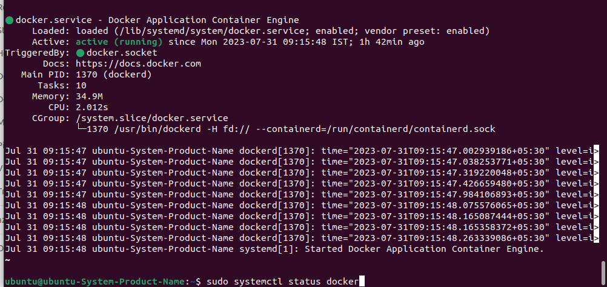
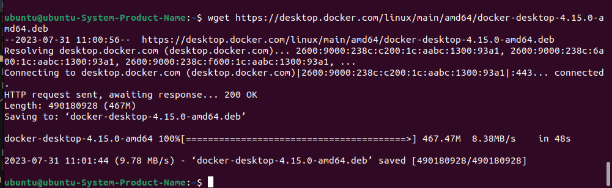

##### Docker Installation on Ubuntu

https://www.simplilearn.com/tutorials/docker-tutorial/how-to-install-docker-on-ubuntu

##### Docker Desktop Installtion on Ubuntu

https://www.linuxtechi.com/how-to-install-docker-desktop-on-ubuntu/

https://askubuntu.com/questions/1374347/error-running-systemd-as-user-failed-to-connect-to-bus-dbus-session-bus-addr

https://docs.docker.com/desktop/install/linux-install/
