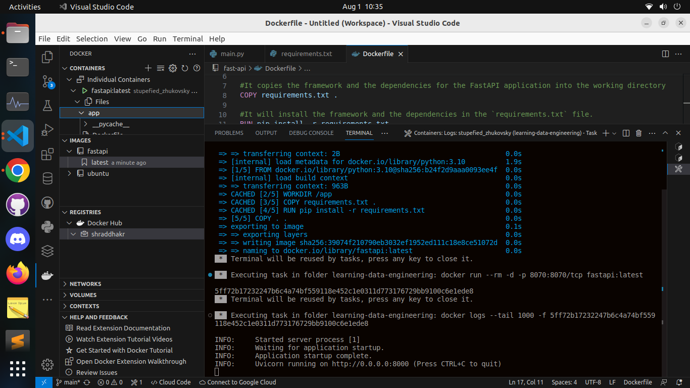
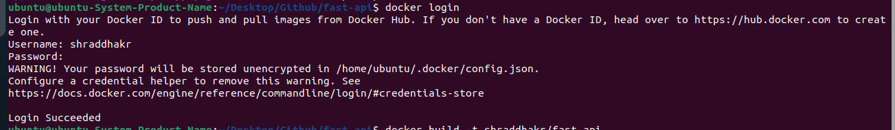
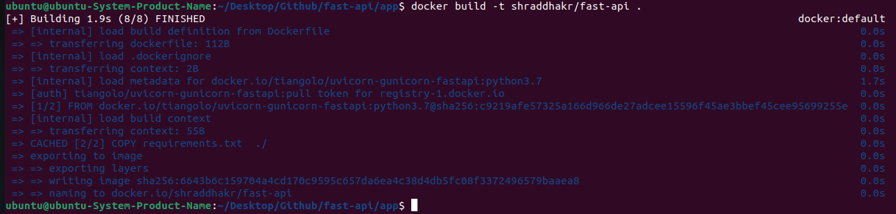
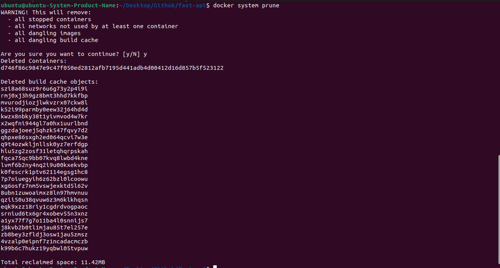

##### 1] Install fastAPI & Uvicorn

##### 2] Swagger Editor

https://swagger.io/

https://swagger.io/tools/swagger-editor/

##### 3] Local API Run

##### 4] Dockerizing a FastAPI App

https://fastapi.tiangolo.com/deployment/docker/

https://sweetcode.io/how-to-dockerize-and-deploy-a-fast-api-application-to-kubernetes-cluster/

##### 5] Build, Launch & Push to DockerHub

CleanUp

